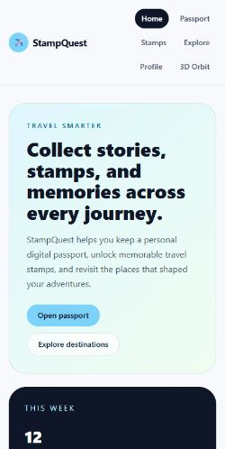

# Accessibility And Lighthouse Audit

Date: 2026-08-25

## Scope

The intended Vercel preview could not be audited anonymously because it redirects to Vercel SSO. The measurements below use the runnable local app at `http://127.0.0.1:4173/`, with Lighthouse's mobile preset. The local result is representative of the committed Vite app, but it is not a claim about the protected Vercel preview.

Key routes checked:

- `/` Home
- `/passport` Passport and validated visit form
- `/chat` AI travel guide
- `/passport-orbit` Interactive 3D experience
- `/motion-lab` Motion demo

## Lighthouse Scores

| Route | Stage | Performance | Accessibility | Best Practices | SEO |
| --- | --- | ---: | ---: | ---: | ---: |
| `/` | Before | 26 | 100 | 96 | 91 |
| `/` | After | 56 | 100 | 96 | 91 |

The performance score is sensitive to the local dev server and Lighthouse's simulated mobile network. The after run was taken with the same mobile settings. The production build still code-splits the 3D route; the main bundle is approximately 102 kB gzip and the Three.js chunk is approximately 190 kB gzip.

### Before

### After

## Findings And Fixes

- Added a skip link and a stable `main#main-content` landmark in the shared layout.
- Added a level-one heading to the Passport route.
- Removed nested `main` landmarks from Chat, Motion Lab, and Passport Orbit routes.
- Exposed the Chat page at `/chat` so its keyboard and live-region behavior is reachable in the main app.
- Added `role="log"`, `aria-live="polite"`, `aria-relevant="additions text"`, and an accessible label to the chat conversation so streamed assistant output is announced without an assertive interruption.
- Kept the native Stop button available while streaming; it is keyboard reachable and has a visible focus state.
- Confirmed form fields and 3D configurator controls have accessible labels. The 3D canvas also has an accessible label and a reduced-motion/static fallback.

## WAVE-Equivalent And Keyboard Pass

The WAVE browser extension was not available in this execution environment, so axe-core was used as the repeatable automated equivalent. The final axe pass reported zero violations on all five key routes listed above.

A Chromium mobile keyboard-only pass confirmed the skip link, navigation links, Home actions, Passport form fields, Chat suggestion buttons and labeled message input, 3D material swatches, and Slow orbit checkbox are reachable in DOM order. Chat's Stop button is covered in the component suite's streaming-state test.

## Remaining Notes

The Vercel preview URL remains protected by SSO and needs an authenticated deployment to produce a public Lighthouse result. Lighthouse itself exits with a Windows `EPERM` cleanup warning after writing the report; the JSON report and screenshots were generated successfully. A production deployment should be audited again after public access is enabled.
